# Phần 1: Làm quen với ngôn ngữ C++  

## 1. Cấu trúc của một chương trình C++  
### 1.1. Thư viện  
- Trong chương trình C++, câu lệnh `#include <iostream>` chính là câu lệnh bổ sung thư viện cần thiết vào chương trình.  
- Các thư viện có sẵn sẽ cung cấp các công cụ như nhập, xuất, các hàm, thuật toán ...  

### 1.2. Namespace  
- Namespace là nơi chúng ta có thể định nghĩa hoặc khai báo mã định danh, tức là biến, hàm, lớp...  
- Ví dụ như `cout`, `endl`, `cin` đều được định nghĩa trong namespace có tên là `std`.  

### 1.3. Hàm main  
- Hàm `main` là nơi chứa các câu lệnh trong chương trình.  
- Các câu lệnh trong C++ được kết thúc bởi dấu `;`.  
- Đây là nơi chương trình bắt đầu được thực thi, nếu không có hàm `main` thì chương trình sẽ không thể chạy được.  

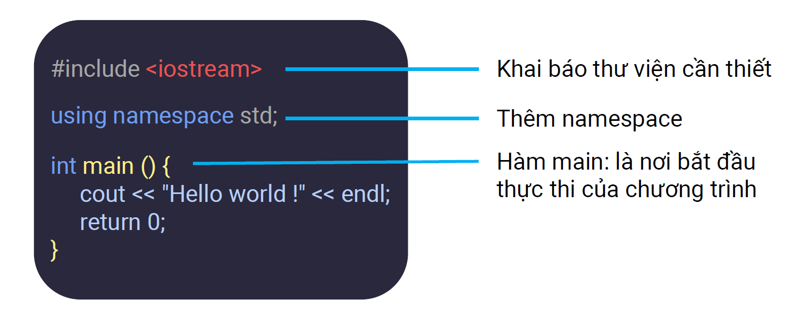

---

## 2. Kiểu dữ liệu (Data Type)
- Kiểu dữ liệu giúp lưu giá trị về số, ký tự, chuỗi ký tự,...  
### 2.1. Kiểu dữ liệu số nguyên (1 byte = 8 bit)  
- Đối với số nguyên, chia làm **số nguyên không dấu** và **số nguyên có dấu**.  
- Từ số byte lưu trữ có thể suy ra số bit cần để biểu diễn số nguyên đó.  
- Giả sử số nguyên có `K` bit:  
  - **Số nguyên có dấu:** - \( 2^{K-1} \) tới \( 2^{K-1} - 1 \)  
  - **Số nguyên không dấu:** 0 tới \( 2^K - 1 \)  
  

### 2.2. Kiểu dữ liệu số thực
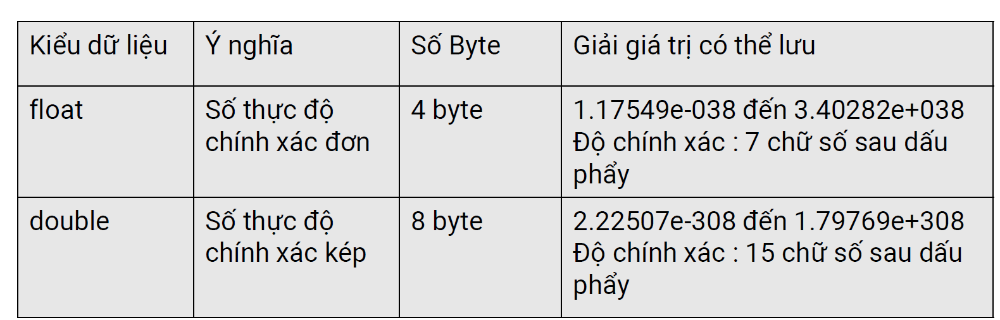
- Ưu tiên sử dụng double vì double có độ chính xác cao hơn float.

### 2.3. Kiểu dữ liệu đúng sai
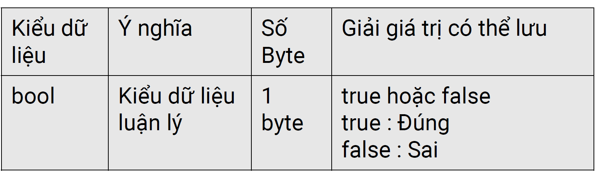

### 2.4. Kiểu dữ liệu ký tự

---

## 3. Biến (Variable)
- Biến được sử dụng để lưu các giá trị trong quá trình tính toán của chương trình.
- Tùy theo kiểu dữ liệu của biến, một ô trong bộ nhớ sẽ được cấp phát để lưu trữ giá trị của biến này.
- **Cú pháp**: [Kiểu dữ liệu] [Tên biến];
- Ví dụ: int x; long long b; char ki_tu; bool check; double dienTich; ...

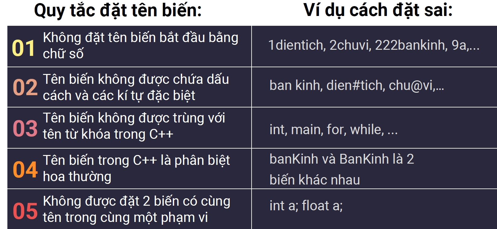

---

## 4. Chú thích (Comment)
### 4.1. Khái niệm  
- Chú thích (Comment) là một giải pháp bổ sung thông tin vào code, nhằm làm rõ nội dung, giải thích câu lệnh, mục đích của code,...
- Giúp người đọc code có thể nắm bắt nội dung code và thuận lợi trong việc bảo trì code.
- Các chú thích sẽ không được coi là câu lệnh và sẽ được loại bỏ khi chương trình thực thi.

### 4.2. Một số ví dụ
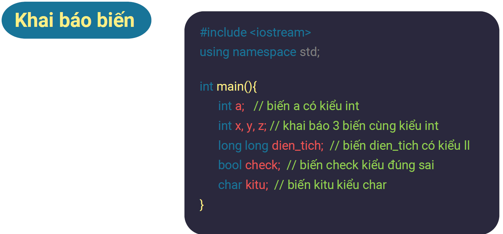

---

## 5. Toán tử gán (Assigment Operator)
- **Cú pháp:** [Toán hạng 1] = [Toán hạng 2]
- **Ý nghĩa:** Gán giá trị của toán hạng 2 cho toán hạng 1
- Ví dụ: ban_kinh = 100; // Gán giá trị 100 cho biến ban_kinh

---

## 6. Toán tử toán học (Arithmetic Operator)

### 6.1. Chú ý 1
- Nếu chia 2 số nguyên tố (int, long long) cho nhau thì phép chia ở trên sẽ là phép chia nguyên, tức là nó chỉ lấy phần nguyên và bỏ phần thập phân ở thương.
- Nếu muốn kết quả ở số thập phân thì ít nhất 1 trong 2 số phải ở kiểu số thưc và biến thương phải ở dạng ở số thực.
  - Ép kiểu
  - Nhân thêm 1 số thực khi tính toán
  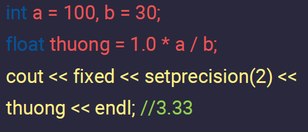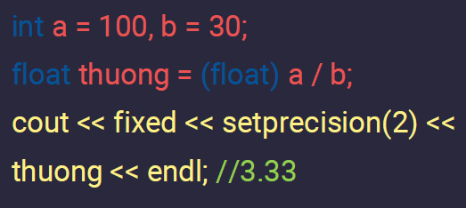

### 6.2. Chú ý 2
- Nếu nhân 2 số nguyên int với nhau mà kết quả của tích vượt giới hạn lưu của số in thì kết quả sẽ bị tràn, ngay cả khi sử dụng biến long long để lưu biến tích. Việc cần xử lý ở đây là can thiệp vào phép nhân.
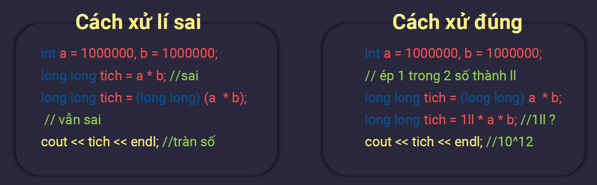

---

## 7. Toán tử so sánh
- Khi sử dụng các toán tử so sánh để so sánh 2 toán hạng thì kết quả của phép so sánh sẽ trả về đúng hoặc sai.

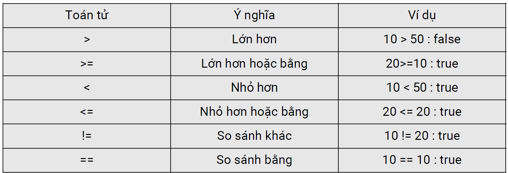

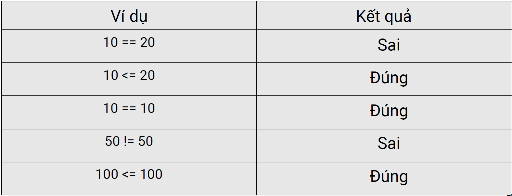

---

## 8. Toán tử logic (Logic Operator)
- Trong trường hợp muốn kết hợp nhiều phép so sánh lại với nhau, sử dụng 3 cổng logic cơ bản của máy tính là AND, OR, NOT.

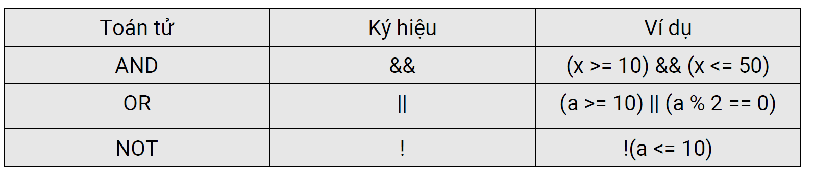

- Để tính toán giá trị cuối cùng của biểu thức, cần xác định giá trị của từng mệnh đề thành phần, sau đó áp dụng bảng chân lý của các cổng logic để tìm giá trị của biểu thức ban đầu.

**- Chú ý:** Cổng AND chỉ cho kết quả đúng khi mọi mệnh đề thành phần đều có giá trị đúng, sai trong các trường hợp còn lại.

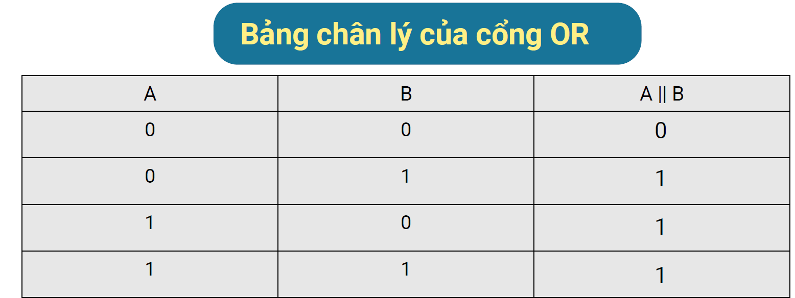

**- Chú ý:** Cổng OR chỉ cho kết quả sai khi mọi mệnh đề thành phần đều có giá trị sai, đúng khi chỉ cần ít nhất 1 mệnh đề thành phần có giá trị đúng.

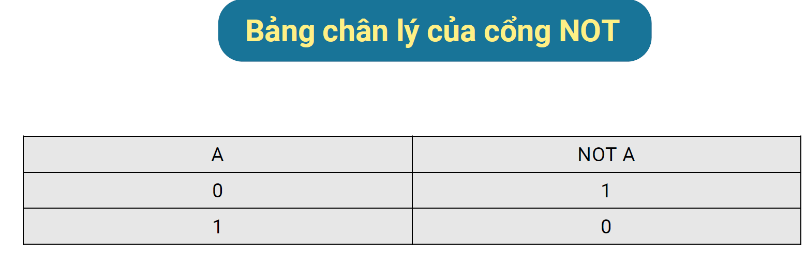

--- 

## 9. Toán tử tăng giảm (Incremen, Decrement Operator)
- Để tăng hoặc giảm giá trị của một biến đi 1 đơn vị, có thể sử dụng toán tử tăng, giảm này sẽ thuận tiện hơn.

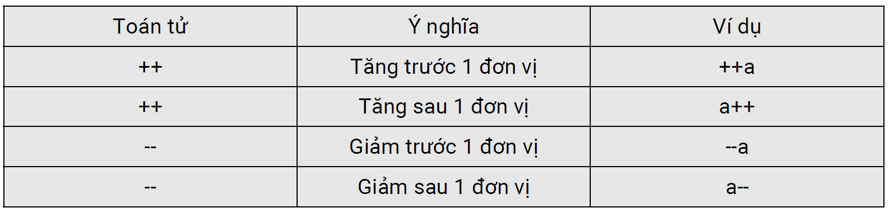

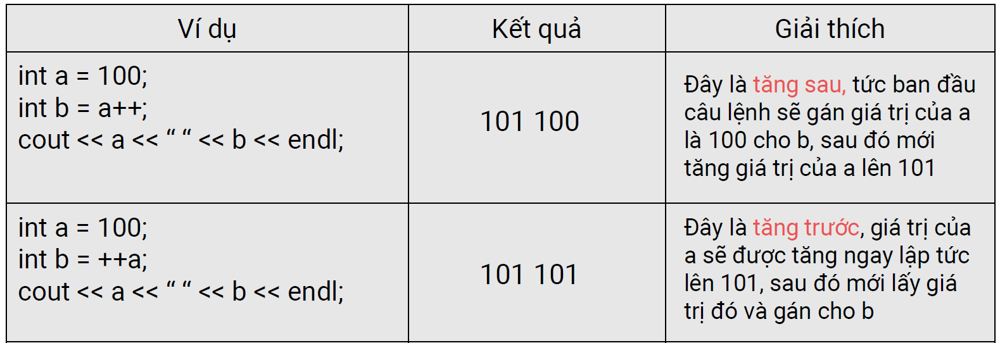

## 10. Toán tử 3 ngôi (Conditional Operator)
- [Biểu thức so sánh] ? [Giá trị trả về khi biểu thức đúng] : [Giá trị trả về khi biểu thức sai]

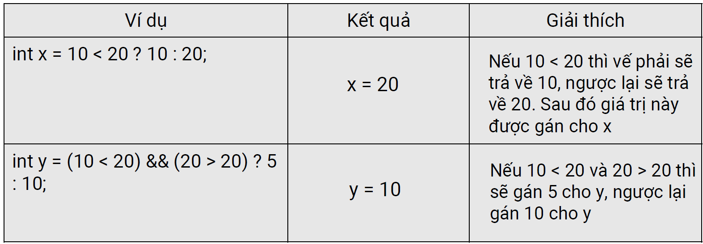

## Chú ý ở phần toán tử
- Các toán tử sẽ có **thự tự ưu tiên nhất định**, ví dụ như nhân chia trước, công trừ sau hoặc cùng mức độ ưu tiên thì thực hiện từ trái sang phải.
- Nhưng **dấu đóng mở ngoặc tròn** luôn có độ ưu tiên cao nhất, vì thể khi viết biểu thức thì nên sử dụng dấu ngoặc để biểu thức được thực thi theo đúng mong muốn của mình.