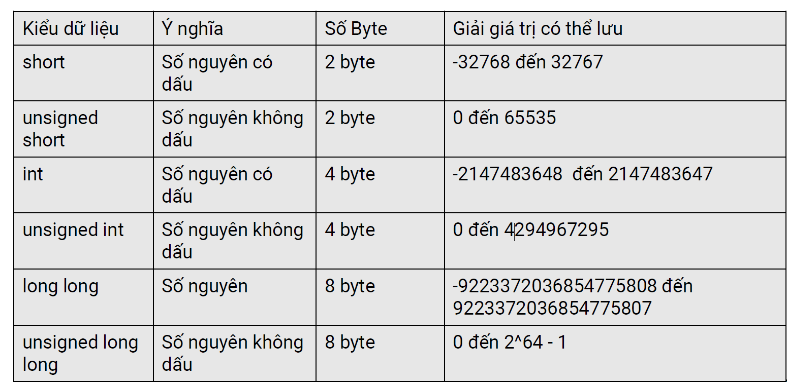
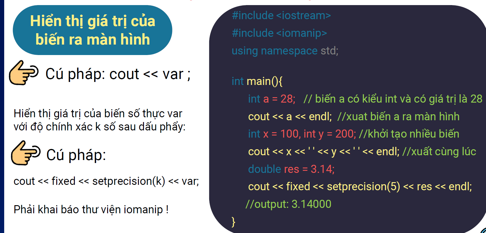

# Phần 1: Làm quen với ngôn ngữ C++  

## 1. Cấu trúc của một chương trình C++  

### 1.1 Thư viện  
- Trong chương trình C++, câu lệnh `#include <iostream>` chính là câu lệnh bổ sung thư viện cần thiết vào chương trình.  
- Các thư viện có sẵn sẽ cung cấp các công cụ như nhập, xuất, các hàm, thuật toán ...  

### 1.2 Namespace  
- Namespace là nơi chúng ta có thể định nghĩa hoặc khai báo mã định danh, tức là biến, hàm, lớp...  
- Ví dụ như `cout`, `endl`, `cin` đều được định nghĩa trong namespace có tên là `std`.  

### 1.3 Hàm main  
- Hàm `main` là nơi chứa các câu lệnh trong chương trình.  
- Các câu lệnh trong C++ được kết thúc bởi dấu `;`.  
- Đây là nơi chương trình bắt đầu được thực thi, nếu không có hàm `main` thì chương trình sẽ không thể chạy được.  

## 2. Kiểu dữ liệu (Data Type)  

### 2.1 Kiểu dữ liệu số nguyên (1 byte = 8 bit)  
- Đối với số nguyên, chia làm **số nguyên không dấu** và **số nguyên có dấu**.  
- Từ số byte lưu trữ có thể suy ra số bit cần để biểu diễn số nguyên đó.  
- Giả sử số nguyên có `K` bit:  
  - **Số nguyên có dấu:** - \( 2^{K-1} \) tới \( 2^{K-1} - 1 \)  
  - **Số nguyên không dấu:** 0 tới \( 2^K - 1 \)  
  

### 2.2 Kiểu dữ liệu số thực

- Ưu tiên sử dụng double vì double có độ chính xác cao hơn float.

### 2.3 Kiểu dữ liệu đúng sai

### 2.4 Kiểu dữ liệu ký tự

## 3. Biến (Variable)
- Biến được sử dụng để lưu các giá trị trong quá trình tính toán của chương trình.
- Tùy theo kiểu dữ liệu của biến, một ô trong bộ nhớ sẽ được cấp phát để lưu trữ giá trị của biến này.
- **Cú pháp**: [Kiểu dữ liệu] [Tên biến];
- Ví dụ: int x; long long b; char ki_tu; bool check; double dienTich; ...

## 4. Chú thích (Comment)

### 4.1 Khái niệm  
- Chú thích (Comment) là một giải pháp bổ sung thông tin vào code, nhằm làm rõ nội dung, giải thích câu lệnh, mục đích của code,...
- Giúp người đọc code có thể nắm bắt nội dung code và thuận lợi trong việc bảo trì code.
- Các chú thích sẽ không được coi là câu lệnh và sẽ được loại bỏ khi chương trình thực thi.

### 4.2 Một số ví dụ

